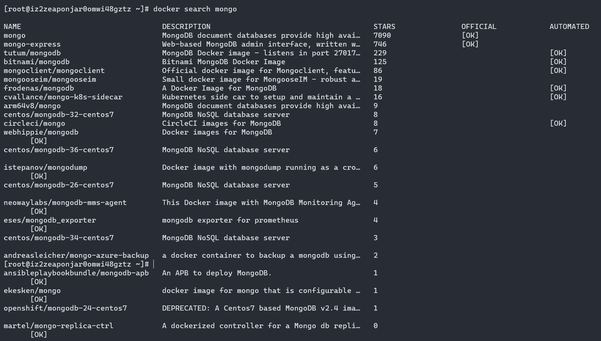
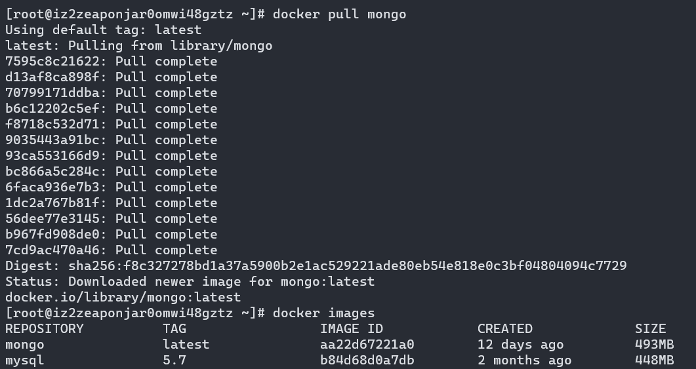
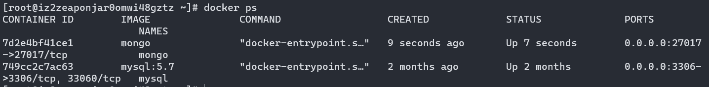

# docker安装MongoDB

**基础环境:**阿里云centos

```bat
docker search mongo
```

结果如下：


```bat
docker pull mongo
```

下载成功：


执行：

```bat
# 运行下载好的mongo镜像
docker run -id --name mongo -p 27017:27017 mongo
```

结果：


## 注意，需要在阿里云开放对应的27017端口才能被远程连接**
